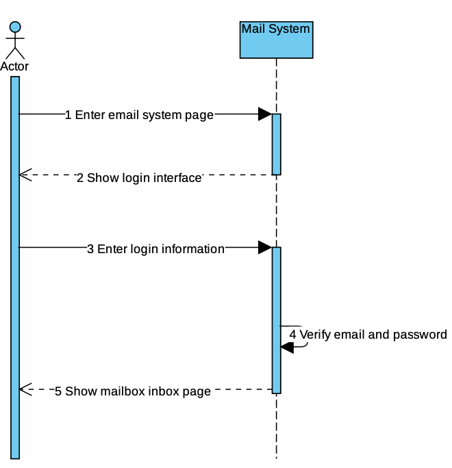

# Mail Server System
## Overview
COEN 275 (OOP) <br>
Contributors: Jihao Chen, Jinming Nian, Yulin Zeng

## Mail Server SPA

node >= 16

## Installation
```
npm install --global yarn
yarn
```

## Run
```
yarn start
```

## Problem Definition
Create a mail server that receives incoming email from users and senders and forwards outgoing messages for delivery. Implement an UI for users to login into the application. 

## Requirement Analysis
- Login/SignUp
  - Users sign up and login with email address and password: we can store these strings in database for authentication. 
- Draft & Send email
  - Draft email is saved in user’s draft box. 
  - Draft email can be edited anytime, and the updates will be saved.
  - User can send a draft email at anytime. 
  - Sent email is saved in user’s outbox. 
  - Sending email to an existing user will make the mail visible for both the sender and the receiver.
- Check all the received emails
  - Every user has an “Inbox” where they can see all the mails sent to them. 
  - When a single page can’t fit all the mails in, user can flip through different pages to view their mail list.
- Read an email: User can click on a mail either in their inbox, outbox, or draft box to see details about the mail:
    - Sender 
    - Title
    - Content 
    - Time sent/edited
 
## Assumption
- User don’t have to register with a certain domain. E.g. xxx@xxmail.com
- User only send email to existing users.
- User can send email to themselves. The email would then be visible in their inbox and outbox.
- Forwarding is not supported at this time, but could be easily implemented 
- Users only send email to one person at a time.

## Use Cases
### Use Cases Analysis
Actor:
* Email User

Use cases for Mail Server:
* Sign Up: Create user profile in backend database so that the user can login later on.
* Login: Use email address and password to gain access to the user’s mailbox.
* Check emails: User can see a list of inbox mails once logged.
* Read emails: In inbox, outbox, or draft box, user can click on any mail to read its content.
* Draft emails: User can start writing an email and not send it. The progress is saved.
* Send emails: User can send emails or saved drafts to any users.
* Delete emails: User can delete any email in any of their boxes.

### Use Case Diagram
  

## OO Concepts
MVC Model
* Front-end view → Controller → Service → DAO (Data Access Object) → Database (MySQL)

Abstract class & Interfaces:
* The entire Service layer.
* The entire DAO layer.

Encapsulation:
* Service functionalities are encapsulated into controllers. Controller is the only entrance for front-end.
* Pojos all have getter and setter methods.

Inheritance:
* SentMail and ReceivedMail are inherited from Mail.

Polymorphism:
* MailController serves both inbox and outbox mails.

## Class Diagram

## Classes
POJO:
* User: Represents the user by the user’s ID, email address, and password.
* Mail: The mail itself, with information about its sender, receiver, content, read status, and time.
* SentMail: Inherited from the Mail object, the unique attributes are an owner ID, a receiver ID, a send status, and a variable to denote if the mail is deleted or not.
* ReceivedMail: Inherited from the Mail object, similar to the SentMail object, but change the “receiver ID” into “sender ID,” and the “send status” to “read status”

DAO:
* UserMapper: Provides methods to get, insert, and update user data.
* MailMapper: Provides methods to get, insert, and update mail data.
* SentMailMapper: Provides methods to get, insert, update, and delete outbox mail data and draft mail data.
* ReceivedMailMapper: Provides methods to get, insert, update and delete inbox mail data.

Services:
* InboxServiceImpl: Provides methods for query, read, and delete inbox mails
* OutboxServiceImpl: Provides methods for query and delete outbox mails
* MailServiceImpl: Provides methods for send email, create or update draft, and get a specific email by ID.
* UserServiceImpl: Provides methods for login and signup.

Controllers:
* MailController: Handles all “/mail” URL subdirectories. Deliver service results related to mails and drafts (read, write, delete, etc).
* UserController: Handles all “/user” URL subdirectories. Deliver service results related to login, logout, register, and get user info.

## Activity Diagram


## Sequence Diagram (Large Scale)
### Login

### SignUp

### Draft

### Send

### Look at Inbox

### Read Email


## Sequence Diagram (Small Scale)
### Login

### SignUp

### Draft

### Send

### Look at Inbox

### Read Email


